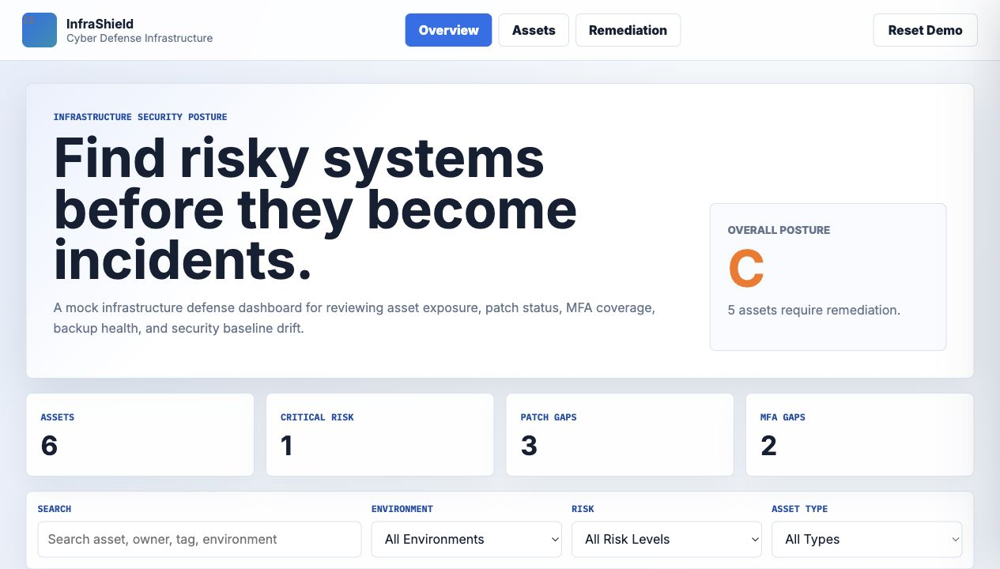
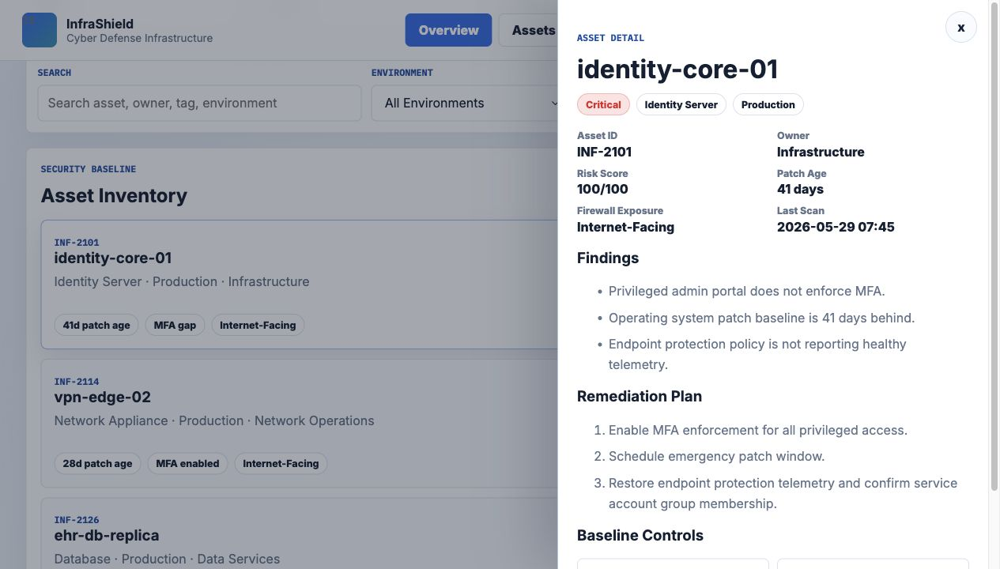

# BB InfraShield

BB InfraShield is a mock cyber defense infrastructure dashboard built for portfolio use. It models how an infrastructure support or cyber defense team might review system risk, patch gaps, MFA coverage, firewall exposure, encryption status, backups, and remediation priorities.

I built this project to complement BB SOC Triage. SOC Triage focuses on alert investigation and incident response. InfraShield focuses on the infrastructure side: finding risky systems before they become incidents and documenting what needs to be fixed.

Live demo: https://briannab1997.github.io/BB-InfraShield/

## Screenshots





## What It Does

- Displays a mock infrastructure asset inventory.
- Scores assets based on patch age, MFA coverage, firewall exposure, encryption, backup health, and endpoint protection.
- Sorts higher-risk systems to the top of the queue.
- Filters systems by search, environment, risk level, and asset type.
- Opens an asset detail drawer with findings and a remediation plan.
- Lets demo users mark controls as remediated, including MFA, encryption, patching, and backups.
- Saves demo changes in browser local storage.
- Includes tests for scoring, filtering, sorting, metrics, updates, and seeded data.

## Why This Project

BB InfraShield is not a real scanner or monitoring tool, but it demonstrates practical infrastructure security thinking through a focused, entry-level-friendly workflow:

- reviewing asset baselines
- prioritizing patch and access control gaps
- understanding exposed systems
- documenting remediation steps
- tracking security posture
- validating risk logic with tests

## Tech Stack

- HTML5
- CSS3
- Vanilla JavaScript
- Browser localStorage
- Node.js test runner

## Run Locally

```bash
npm start
```

Then open:

```text
http://localhost:8000
```

## Test

```bash
npm test
```

## Project Structure

```text
.
├── css/
│   └── style.css
├── js/
│   ├── app.js
│   ├── data.js
│   └── infrastructureService.js
├── tests/
│   └── infrastructureService.test.js
├── index.html
├── package.json
└── README.md
```

## Portfolio Summary

BB InfraShield is a mock infrastructure security dashboard for reviewing asset exposure, patch status, MFA coverage, backup health, encryption gaps, and remediation priorities. It demonstrates cyber defense infrastructure support, risk scoring, workflow design, and tested JavaScript logic.
